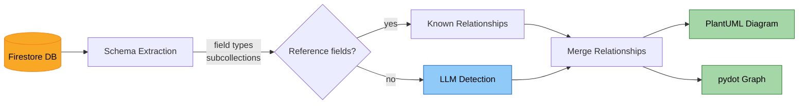

# Firestore Schema and Relationships Visualization

Extract the schema of a Firestore database, identify relationships between collections, and generate visual representations of the schema and relationships using PlantUML and pydot.

*Note: this is an exploratory project and not meant for production usage.*



## Features

- **Extract Firestore Schema**: Retrieve the schema of a Firestore database, including collection names, field names, and inferred field types (string, number, boolean, timestamp, reference, etc.).
- **Subcollection Discovery**: Recursively discover and include subcollections (e.g., `users.posts.comments`).
- **Identify Relationships**: Detect foreign key relationships between collections using two methods (see [How relationship detection works](#how-relationship-detection-works)).
- **Generate Schema Graph**: Create a visual representation of the Firestore schema and relationships using pydot.
- **Generate PlantUML Diagram**: Generate PlantUML class diagrams with typed fields and relationship arrows.

## Installation

1. Clone the repository.

2. Create a virtual environment and activate it:
    ```sh
    python -m venv venv
    source venv/bin/activate
    ```

3. Install dependencies:
    ```sh
    pip install -r requirements.txt
    ```

4. Set up environment variables (only needed if using LLM relationship detection):
    ```sh
    export OPENAI_API_KEY='your-api-key'
    ```

## Usage

```sh
# Full run with defaults
python main.py

# Quick run - fewer samples, no subcollections, skip LLM
python main.py --sample-size 10 --max-depth 0 --skip-llm

# Only top-level collections with PlantUML output
python main.py --max-depth 0 --format plantuml

# Deeper subcollection discovery with smaller sample
python main.py --max-depth 5 --sample-size 20
```

### CLI Options

| Flag | Default | Description |
|------|---------|-------------|
| `--sample-size N` | 50 | Number of documents to sample per collection |
| `--max-depth N` | 3 | Maximum subcollection nesting depth (0 to skip subcollections) |
| `--skip-llm` | off | Skip LLM relationship detection (only use reference-type fields) |
| `--format` | all | Output format: `all`, `plantuml`, or `pydot` |

### Quick mode

For a fast overview without LLM costs or subcollection crawling:

```sh
python main.py --sample-size 10 --max-depth 0 --skip-llm
```

## How relationship detection works

Relationships between collections are detected in two layers:

1. **Reference fields (automatic, no LLM)** - During schema extraction, Firestore `DocumentReference` fields are detected directly. These are actual pointers to other documents, so the target collection is known with certainty. This happens for free as part of schema extraction.

2. **Name-based inference (LLM)** - Many relationships are stored as plain string or number fields (e.g., `user_id`, `author_email`) rather than native references. An LLM examines the full schema and field names to infer which fields likely refer to other collections. This requires an OpenAI API key and makes one API call per collection.

### What `--skip-llm` does

With `--skip-llm`, only layer 1 runs. You get relationships for `DocumentReference` fields but miss name-based ones. For example, if a `posts` collection has a `user_id` string field pointing to `users`, that relationship won't be detected.

Use `--skip-llm` when you want a quick overview, want to avoid API costs, or don't have an OpenAI key. The schema extraction itself (field names, types, subcollections) is unaffected.

## Tests

```sh
python -m pytest tests/ -v
```

## License
[MIT License](LICENSE)